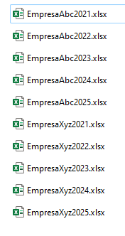
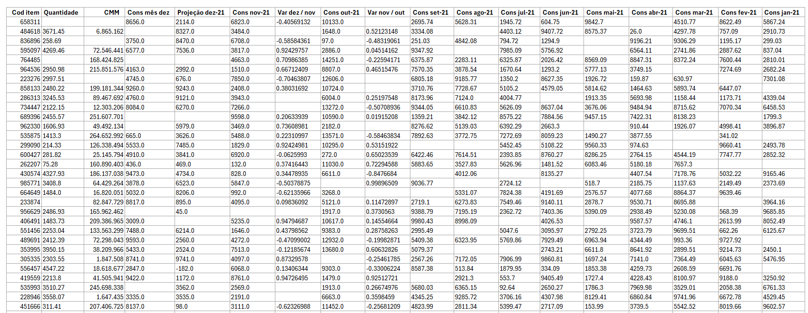
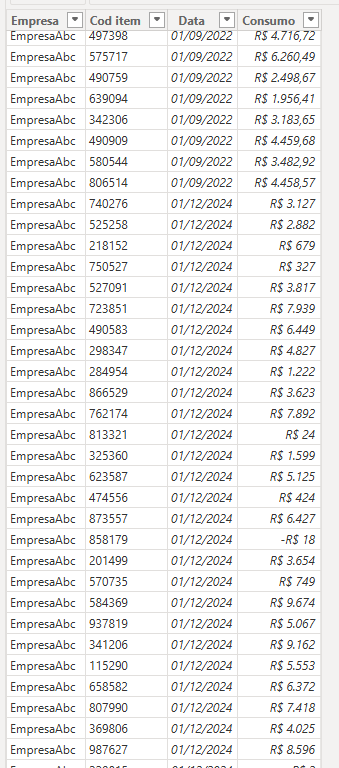

# 🧪 Power Query - Treinamento de ETL

Este projeto é um exercício prático de **ETL (Extração, Transformação e Carga)** utilizando o Power Query, com base na videoaula [ETL no Power BI - Linguagem M Avançada](https://www.youtube.com/watch?v=SmIXNOnp1SE) do canal [Alison Pezzott](https://www.youtube.com/@AlisonPezzott).

O objetivo foi simular um processo real de tratamento de dados, aplicando recursos da linguagem **M** dentro do Power Query Editor.

---

## ⚠️ Aviso sobre os dados

> Os dados utilizados neste projeto são **totalmente fictícios**, criados de forma aleatória com auxílio do ChatGPT, e **não possuem qualquer vínculo com pessoas, empresas ou instituições reais**. Seu uso é exclusivamente didático.

---

## 📁 Estrutura do projeto

```
power-query-0001/
│
├── base/
│   ├── EmpresaAbc2021.xlsx
│   ├── EmpresaAbc2022.xlsx
│   ├── EmpresaAbc2023.xlsx
│   ├── EmpresaAbc2024.xlsx
│   ├── EmpresaAbc2025.xlsx
│   ├── EmpresaXyz2021.xlsx
│   ├── EmpresaXyz2022.xlsx
│   ├── EmpresaXyz2023.xlsx
│   ├── EmpresaXyz2024.xlsx
│   └── EmpresaXyz2025.xlsx
│
├── img/
│   ├── TabelaOriginal1.png
│   ├── TabelaOriginal2.png
│   ├── TabelaPronta.png
│   └── Matriz.png
│
├── Tratamento.pq            ← Código M utilizado no Power Query para criar uma função com as etapas necessárias ao tratamento de dados.
├── Tratamento.md            ← Permite visualizar o código de forma mais amigável no Github.
├── DadosConsolidados.pq     ← Código M utilizado no Power Query para consolidar as tabelas aplicando as etapas da função tratamento.
├── DadosConsolidados.md     ← Permite visualizar o código de forma mais amigável no Github.
├── Treino_de_ETL.pbix       ← Arquivo do Power BI pronto.
└── README.md
```

---

## 🧰 Ferramentas utilizadas

- **Power BI Desktop** (Editor Power Query)
- **Linguagem M** (Power Query Formula Language)
- **Excel** como fonte de dados
- **ChatGPT** para geração aleatória de dados fictícios

---

## 🚀 Etapas realizadas no ETL

### ✅ Antes (dados brutos):



---

### ⚙️ Transformações aplicadas:
1. **Conversão de tipos de dados**
2. **Remoção de colunas e valores nulos**
3. **Unpivot (Desagrupar colunas de consumo mensal)**
4. **Renomeação de colunas**
5. **Adição de colunas personalizadas**
6. **Formatação final para análise no Power BI**

---

### 🟢 Resultado final:



---

## 📄 Código-fonte

O código completo das transformações pode ser consultado nos arquivos [`Tratamento.pq`](Tratamento.pq) e [`DadosConsolidados.pq`](DadosConsolidados.pq).

---

## 📎 Referência

- [🎥 ETL no Power BI - Linguagem M Avançada (YouTube)](https://www.youtube.com/watch?v=SmIXNOnp1SE)


